<!-- Generated by GitHub Profile Agent Console. Edit profile.config.json, then run npm run generate. -->

  <picture>
    <source media="(max-width: 760px) and (prefers-color-scheme: dark)" srcset="./assets/hero/agent-console-8d935fd7-mobile-dark.svg">
    <source media="(max-width: 760px)" srcset="./assets/hero/agent-console-8d935fd7-mobile-light.svg">
    <source media="(prefers-color-scheme: dark)" srcset="./assets/hero/agent-console-8d935fd7-dark.svg">
    <source media="(prefers-color-scheme: light)" srcset="./assets/hero/agent-console-8d935fd7-light.svg">
    
  </picture>

  
  

## About Me

I build practical AI products and full-stack tools for real workflows, with a focus on clear interfaces, reliable systems, and measurable user value.

My public work spans legal technology, personal finance, and operational software—from product design and frontend engineering to APIs, data, and deployment.

## Current Focus

| Area | What I am exploring |
| --- | --- |
| **Applied AI** | Turning model capabilities into useful, testable workflows with clear product value. |
| **LegalTech** | Making legal information and assistance easier to access and understand. |
| **Product Engineering** | Taking ideas from focused prototypes to maintainable, deployed products. |
| **Workflow Automation** | Reducing repetitive operational work through thoughtful software systems. |

## Featured Work

| Project | Focus | Why it matters |
| --- | --- | --- |
| [**Yurist AI**](https://github.com/lazizbeksaidov/yurist-ai) | AI-assisted legal information | A Next.js legal assistant for Uzbekistan that structures questions, relevant legal context, and practical next steps in a conversational experience. |
| [**Moliya Hisobot**](https://github.com/lazizbeksaidov/moliya-hisobot) | Personal finance PWA | A personal finance application for tracking loans, income, expenses, budgets, and recurring transactions with clear analysis and optional Supabase sync. |
| [**Intizom**](https://github.com/lazizbeksaidov/davomat-tizimi) | Attendance and operations | A web-based employee attendance and execution-discipline monitoring system designed around practical organizational workflows. [Live](https://xodimlar-7c13c.web.app/) |
| [**Navoiy Yuridik**](https://github.com/lazizbeksaidov/navoiy-yuridik-site) | Public legal information | A responsive legal information website that organizes regional services and resources into an accessible public experience. |

## Product Direction

I am exploring how AI can support high-context workflows without hiding uncertainty. My direction is to combine grounded domain logic, useful interfaces, and bounded automation so people can understand the system, verify its output, and act with confidence.

## Tech Stack

`TypeScript` · `JavaScript` · `Python` · `React` · `Next.js` · `FastAPI` · `Tailwind CSS` · `PostgreSQL` · `Supabase` · `Firebase` · `Docker` · `Git`

## Recent Activity

<!-- AUTO:ACTIVITY:START -->
- Aug 3, 2026: created a branch in [lazizbeksaidov/lazizbeksaidov](https://github.com/lazizbeksaidov/lazizbeksaidov).
- Jul 26, 2026: pushed 1 commit to [lazizbeksaidov/navoiy-yuridik-site](https://github.com/lazizbeksaidov/navoiy-yuridik-site).
- Jul 24, 2026: pushed 1 commit to [lazizbeksaidov/navoiy-yuridik-site](https://github.com/lazizbeksaidov/navoiy-yuridik-site).
- Jul 23, 2026: pushed 1 commit to [lazizbeksaidov/navoiy-yuridik-site](https://github.com/lazizbeksaidov/navoiy-yuridik-site).
- Jul 16, 2026: pushed 1 commit to [lazizbeksaidov/davomat-tizimi](https://github.com/lazizbeksaidov/davomat-tizimi).
<!-- AUTO:ACTIVITY:END -->

---

  Building thoughtful AI products and useful software for real-world workflows.

