<picture>
  <source media="(prefers-color-scheme: dark)" srcset="./assets/dark.svg">
  <source media="(prefers-color-scheme: light)" srcset="./assets/light.svg">
  
</picture>

<h3 align="center">Practical AI · LegalTech · Full-stack product engineering</h3>

  I turn real workflow problems into clear, useful, and maintainable software.

## About

I am a product-minded developer focused on practical AI, legal technology, and workflow automation. I enjoy taking an idea from the first prototype to a working product—shaping the interface, building the application logic, connecting the data layer, and shipping it.

My public work explores legal information, personal finance, and operational tools designed around real user needs.

## Toolkit

`TypeScript` · `JavaScript` · `Python` · `React` · `Next.js` · `FastAPI` · `Tailwind CSS` · `PostgreSQL` · `Docker` · `Git`

## Selected work

| Project | What it does | Core technologies |
| --- | --- | --- |
| [Yurist AI](https://github.com/lazizbeksaidov/yurist-ai) | AI-assisted legal information experience | Next.js, TypeScript, Firebase, Gemini |
| [Moliya Hisobot](https://github.com/lazizbeksaidov/moliya-hisobot) | Personal finance PWA for budgets, loans, income, and expenses | JavaScript, Chart.js, Supabase |
| [Davomat Tizimi](https://github.com/lazizbeksaidov/davomat-tizimi) | A focused attendance-management workflow | JavaScript, HTML |
| [Navoiy Yuridik](https://github.com/lazizbeksaidov/navoiy-yuridik-site) | Accessible legal information on the web | JavaScript, CSS, HTML |

## How I build

- Start with the user’s actual problem.
- Prefer simple architecture and a clear interface.
- Use AI where it creates measurable value—not as decoration.
- Iterate quickly, verify carefully, and ship useful outcomes.

  <a href="https://github.com/lazizbeksaidov?tab=repositories">Explore my repositories</a>
  ·
  <a href="https://github.com/lazizbeksaidov">Follow what I am building</a>

